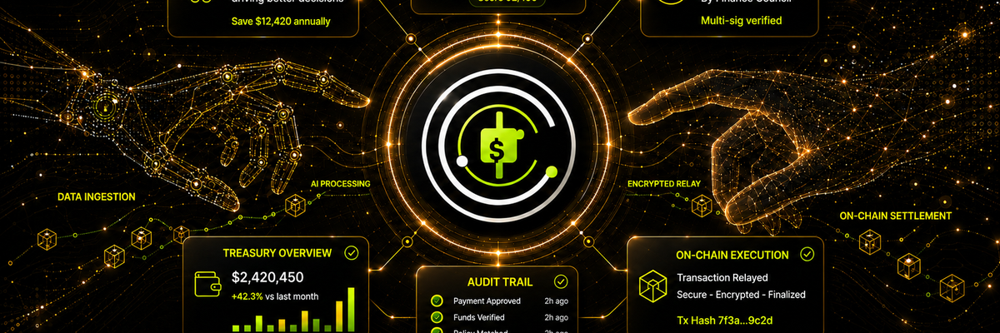
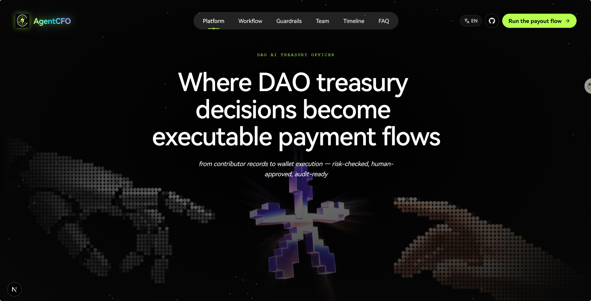
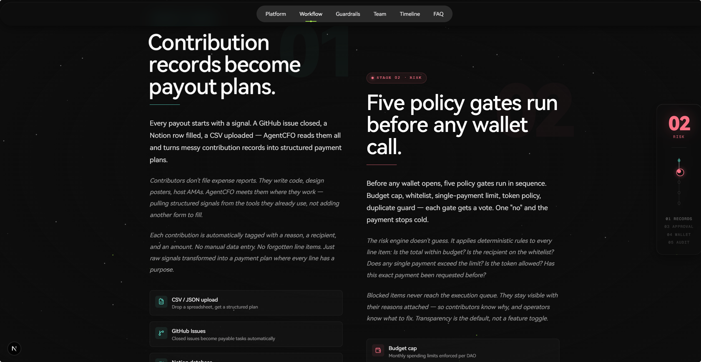
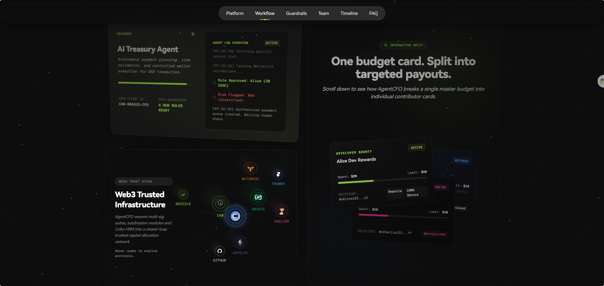
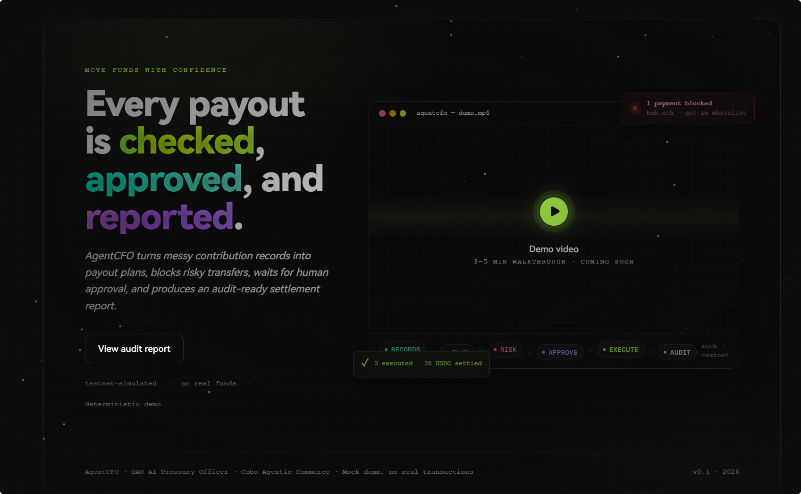
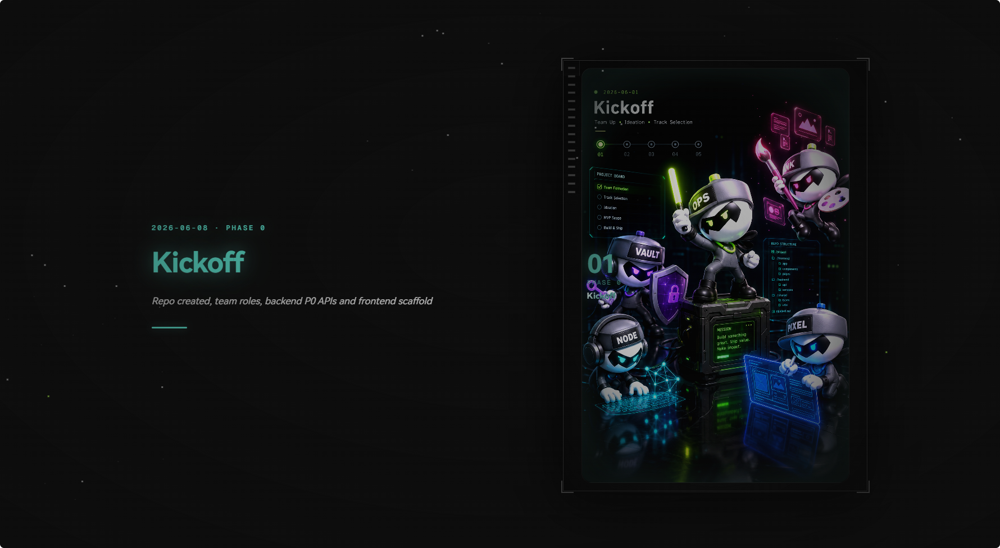
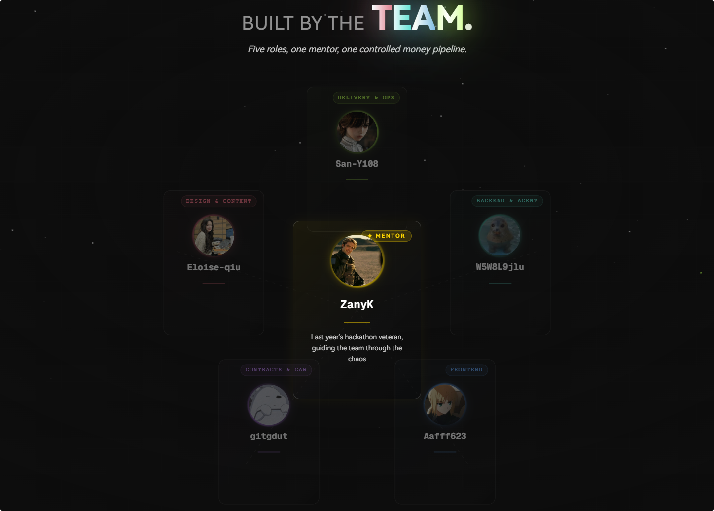
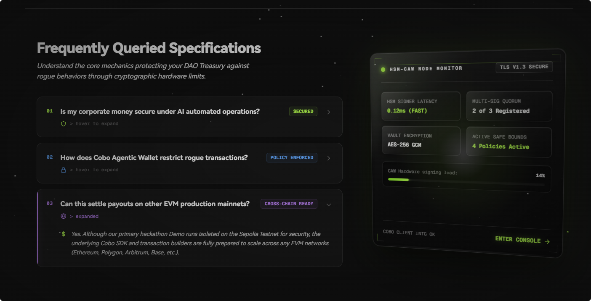
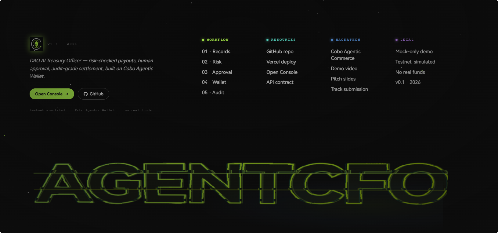
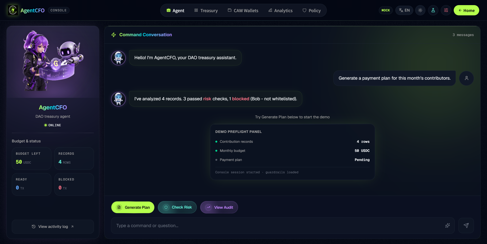

<p align="center">
  <h1 align="center">AgentCFO — Give every DAO an AI CFO with a controlled wallet</h1>
  <p align="center">AgentCFO 是面向 Web3 小团队 / DAO 的 AI 财务官。它读取贡献记录与预算规则，生成 Payment Plan，执行 Risk Check，在 Human Approval 之后通过 <strong>Cobo Agentic Wallet (CAW)</strong> 完成受控付款，并输出可审计的 Audit Report。赛道：<strong>Cobo 赛道｜Agentic Economy × CAW</strong></p>
</p>

<p align="center">
  
</p>

<p align="center">
  <a href="https://agentcfo-frontend.vercel.app"></a>
  <a href="https://agentcfo-backend.onrender.com/health"></a>
  
  
  <a href="https://github.com/San-Y108/agent-cfo"></a>
</p>

<p align="center">
  <a href="#功能">功能</a> · <a href="#演示">演示</a> · <a href="#快速开始">快速开始</a> · <a href="#架构">架构</a> · <a href="#api-参考">API 参考</a> · <a href="#路线图">路线图</a> · <a href="#文档">文档</a> · <a href="#团队">团队</a> · <a href="#许可证">许可证</a>
</p>

---

## 为什么需要 AgentCFO

DAO 小团队经常遇到：

- 贡献者结算靠人工表格，容易漏发、错发、重复发
- DAO 支出不透明，事后很难追踪
- 普通多签虽然安全，但每笔小额付款都要多人确认，效率低
- 完全自动化又有风险，容易失控

**AgentCFO 的核心边界：**


| 组件             | 职责                               |
| -------------- | -------------------------------- |
| Agent / LLM    | 整理贡献记录、生成付款计划、解释付款原因             |
| Risk Engine    | 确定性风控（预算、白名单、限额、重复付款）            |
| Human Approval | 保留关键确认权；blocked 项不可执行            |
| CAW Adapter    | 受控资金执行，隔离 Cobo Agentic Wallet 调用 |
| Audit Report   | 串联计划、风险、审批与执行结果，形成可审计记录          |


```text
Contribution Records → AI Payment Plan → Risk Check → Human Approval
  → Cobo Agentic Wallet → Tx Hash → Audit Report
```

---

## 功能


| 功能                  | 说明                             |
| ------------------- | ------------------------------ |
| **AI Payment Plan** | 根据贡献记录生成结构化付款计划和付款原因           |
| **Agent Hub Chat**  | Console Agent 页对话，经后端代理 MiniMax（`POST /api/agent/chat`） |
| **Risk Check**      | 检查预算、白名单、单笔限额、token 和重复付款      |
| **Human Approval**  | 付款执行前必须有人类确认                   |
| **CAW Execution**   | 真实付款路径必须经过 Cobo Agentic Wallet |
| **Audit Report**    | 输出付款原因、风险结果、执行状态、剩余预算和 tx hash |
| **Mock Mode**       | CAW 不稳定时可演示完整流程，必须清楚标注为 mock   |


**Cobo Agentic Commerce 匹配：**


| 方向                         | AgentCFO 如何匹配                             |
| -------------------------- | ----------------------------------------- |
| Agent-Native Payments      | Agent 根据贡献记录和预算规则，自动生成付款计划并发起付款           |
| Agent Resource Procurement | Agent 可判断 DAO 需支付的工具订阅、服务费用，在预算范围内完成结算    |
| A2A Economy / Treasury     | 后续可扩展多 Agent 各自管理部门预算，统一向 DAO Treasury 汇报 |


---

## 演示

### Demo 场景


| 对象       | 类型   | 说明                   | 金额      |
| -------- | ---- | -------------------- | ------- |
| Alice    | 贡献者  | 写了一篇活动复盘             | 20 USDC |
| Bob      | 贡献者  | 设计了活动海报（**白名单风险演示**） | 15 USDC |
| Charlie  | 贡献者  | 维护社群并整理数据            | 10 USDC |
| Data API | 工具订阅 | 本月数据服务订阅费            | 5 USDC  |


月预算 **50 USDC**，单笔限额 **25 USDC**。Bob 钱包不在白名单 → **blocked**；其余 3 笔通过检查并在人工确认后执行。

### Showcase — Landing Page

营销落地页一览（点击缩略图可放大）：

| | | |
|:---:|:---:|:---:|
| [](assets/images/readme/landing-hero.png)<br><br>**Landing Hero**<br>DAO AI 财务官首屏 · 价值主张与 CTA<br>[Live Demo](https://agentcfo-frontend.vercel.app) | [](assets/images/readme/landing-pipeline.png)<br><br>**Pipeline**<br>Contribution → Plan → Risk → Approval → CAW → Audit<br>[Live Demo](https://agentcfo-frontend.vercel.app) | [](assets/images/readme/landing-platform.png)<br><br>**Platform**<br>AgentCFO 平台能力与模块边界<br>[Live Demo](https://agentcfo-frontend.vercel.app) |
| [](assets/images/readme/landing-guardrails.png)<br><br>**Guardrails**<br>预算、白名单、Human Approval · fail-closed<br>[Live Demo](https://agentcfo-frontend.vercel.app) | [](assets/images/readme/landing-timelines.png)<br><br>**Timelines**<br>从 scaffold 到 CAW testnet evidence<br>[Live Demo](https://agentcfo-frontend.vercel.app) | [](assets/images/readme/landing-built-by-teams.png)<br><br>**Built by Teams**<br>多角色协作交付叙事<br>[团队](#团队) |
| [](assets/images/readme/landing-faq.png)<br><br>**FAQ**<br>评委与访客常见问题<br>[Live Demo](https://agentcfo-frontend.vercel.app) | [](assets/images/readme/landing-footer.png)<br><br>**Footer**<br>进入 Console 与产品收尾 CTA<br>[Console](https://agentcfo-frontend.vercel.app/console) | |

### Showcase — Command Center

业务功能界面（Console Command Center）：

| | | |
|:---:|:---:|:---:|
| [](assets/images/readme/console-agent-hub.png)<br><br>**Agent Hub**<br>Agent-first 工作台 · Payment Plan → Risk → Approval → Execution<br>[Console Demo](https://agentcfo-frontend.vercel.app/console) | 🔜 **Treasury**<br>资金与付款计划总览<br>截图待补充 | 🔜 **Policy**<br>风控规则与 Guardrails 配置<br>截图待补充 |

### Demo Video

> [TODO] 3–5 分钟 Demo 视频链接（YouTube / Bilibili / Loom）。
> 视频需走通核心用户流程，并明确说明展示的是 mock mode 还是真实 CAW testnet transfer。
> 当前已有 2 笔低额 CAW testnet tx hash；视频需说明它们只证明 testnet transfer 能力，默认 mock fallback 仍保留。

路演 PPT（ppt-master）：[`assets/ppt/agentcfo-pitch.pptx`](assets/ppt/agentcfo-pitch.pptx) · 物料 PDF：[`assets/ppt/material/agentcfo-pitch-material-team-v1.pdf`](assets/ppt/material/agentcfo-pitch-material-team-v1.pdf)

---

## 快速开始

### 30 秒看 Demo（前端 mock mode）

```bash
git clone https://github.com/San-Y108/agent-cfo.git
cd agent-cfo/frontend
pnpm install
PORT=3100 pnpm dev
```

打开 [http://localhost:3100/console](http://localhost:3100/console) 查看完整 Demo 流程。

### 验证线上后端

```bash
curl https://agentcfo-backend.onrender.com/health
curl https://agentcfo-backend.onrender.com/api/demo-sample
```

预期 health 返回：`{"status":"ok","service":"agent-cfo-backend"}`

### Demo Smoke Test

本地或 Render 部署后，建议按此顺序做快速检查：

```bash
curl http://127.0.0.1:8000/health
curl http://127.0.0.1:8000/version
curl http://127.0.0.1:8000/api/demo-sample
```

| 项目 | 当前值 |
|---|---|
| API mode | `mock-demo` |
| CAW mode | `mock`（Render 默认） |
| P0 flow | `payment-plan → risk-check → execute-payment → audit-report` |

### 新队友阅读顺序

| 顺序 | 路径 | 目的 |
|---|---|---|
| 1 | `README.md` | 项目、Demo、当前限制 |
| 2 | `AGENTS.md` / `CLAUDE.md` | 团队边界与目录职责 |
| 3 | `app/` + `tests/` | P0 API 与验收用例 |
| 4 | `docs/` · `assets/` · `inbox/` | PM 文档、交付物、待归类投递 |
| 5 | `frontend/CLAUDE.md` | 前端专项（仅前端同学） |

后端原则：先跑通 P0 demo loop；不把 LLM 当最终授权层；不把 mock tx 当真实 CAW 交易。

<details>
<summary>Windows — 本地后端开发</summary>

```powershell
git clone https://github.com/San-Y108/agent-cfo.git
cd agent-cfo
python -m venv .venv
.venv\Scripts\python -m pip install -r requirements.txt
.venv\Scripts\python -m pytest -q
.venv\Scripts\python -m uvicorn app.main:app --reload
```

健康检查：

```powershell
curl.exe http://127.0.0.1:8000/health
curl.exe http://127.0.0.1:8000/api/demo-sample
```

</details>

<details>
<summary>macOS / Linux — 本地后端开发</summary>

```bash
git clone https://github.com/San-Y108/agent-cfo.git
cd agent-cfo
python -m venv .venv
.venv/bin/python -m pip install -r requirements.txt
.venv/bin/python -m pytest -q
.venv/bin/python -m uvicorn app.main:app --reload
```

</details>

<details>
<summary>队友交接 — 前端 / CAW 同学拿 mock API</summary>

```bash
git clone https://github.com/San-Y108/agent-cfo.git
cd agent-cfo
git pull
git log --oneline --max-count=3
```

然后按上方 Windows/macOS 步骤创建虚拟环境、安装依赖、跑测试、启动服务。`/api/demo-sample` 返回可复制 mock payload；Alice/Charlie 在白名单，Bob 故意 blocked。

完整路由与 handoff 说明见 [`docs/backend/DEPLOYMENT.md`](docs/backend/DEPLOYMENT.md)。

</details>

<details>
<summary>边缘情况 — CAW testnet real mode、Render 部署、环境变量</summary>

默认全程 **mock mode**，不需要任何 CAW secrets。

| 场景 | 说明 |
|---|---|
| Render 部署 | Build: `pip install -r requirements.txt` · Start: `python -m uvicorn app.main:app --host 0.0.0.0 --port $PORT` |
| 生产 CORS | `CORS_ALLOWED_ORIGINS=https://agentcfo-frontend.vercel.app` |
| CAW real mode | 需显式设置 `CAW_ADAPTER_MODE=real` + `CAW_ENABLE_TRANSFERS=true` 及全套 CAW env vars |
| OpenAI planner | `PAYMENT_PLANNER_MODE=openai` + `OPENAI_API_KEY`（默认 `mock`） |
| Agent Hub 聊天 | `MINIMAX_API_KEY` + 可选 `MINIMAX_BASE_URL` / `MINIMAX_MODEL`（默认 `MiniMax-M2.5-highspeed`） |
| 持久化 | 本地默认 SQLite `agentcfo_demo.sqlite3`；Render 需挂载 persistent disk |

完整说明：

- CAW Adapter / Phase 4C / Observer → [`docs/backend/CAW_ADAPTER.md`](docs/backend/CAW_ADAPTER.md)
- Render / Planner / Persistence → [`docs/backend/DEPLOYMENT.md`](docs/backend/DEPLOYMENT.md)
- 环境变量全表 → [`docs/backend/ENV_VARS.md`](docs/backend/ENV_VARS.md)

**安全纪律：** 不提交 `.env`、API key、pact-scoped key；不把 mock tx 当作真实链上交易。

</details>

---

## 架构

```text
Frontend (Next.js)
  → Backend API (FastAPI)
    → Agent / LLM Planner
    → Risk Engine
    → Human Approval Gate
    → CAW Adapter (Mock / Real testnet)
    → Audit Report
```


| 层        | 技术                                               | 部署                                                         |
| -------- | ------------------------------------------------ | ---------------------------------------------------------- |
| Frontend | Next.js 16 · React 19 · TypeScript · Tailwind v4 | [Vercel](https://agentcfo-frontend.vercel.app)（mock mode）  |
| Backend  | Python · FastAPI · Pydantic · pytest · SQLite    | [Render](https://agentcfo-backend.onrender.com)（mock mode） |
| CAW      | `cobo-agentic-wallet==0.1.40`                    | 默认 MockCawAdapter；opt-in testnet RealCawAdapter            |


**仓库状态：** 已 scaffold FastAPI P0 MVP（mock 默认 + opt-in real CAW skeleton）；前端已部署 Vercel；后端已部署 Render。真实 CAW 未在 Render 默认启用。

**关键原则：**

- LLM 只生成计划和解释；Risk Engine 是唯一决定 `Ready` / `NeedsApproval` / `Blocked` 的地方
- Execute Payment 必须 `humanApproval.approved=true`；blocked 项不进 adapter
- Audit Report 为执行时快照；后续 CAW status refresh 不可改写
- RealCawAdapter 缺 env / allowlist / policy 时 fail closed
- Read-only observer 只查询，不触发转账

详见 [`docs/backend/CAW_ADAPTER.md`](docs/backend/CAW_ADAPTER.md)。

### CAW Testnet 证据（公开脱敏）

#### Demo payment（AgentCFO 流程）

| 字段              | 公开证据                                                                 |
| --------------- | -------------------------------------------------------------------- |
| chain / token   | `SETH` / `SETH`                                                      |
| amount          | `0.001`                                                              |
| recipient       | `0xAf3f...594B`                                                      |
| source          | `0x2cda...76da`                                                      |
| request_id      | `agentcfo_exec_demo_002_pay_001`                                     |
| provider status | `900`                                                                |
| txHash          | `0x85a5a2e934ca0e34c7fb3e038ca06e54e15bd29b56b64e5b01ff80eb20ed4d98` |
| audit log       | `transfer.allowed` and `transfer.initiate` were allowed              |

#### Internal transfer（同钱包验证）

| 字段              | 公开证据                                                                 |
| --------------- | -------------------------------------------------------------------- |
| chain / token   | Sepolia / `SETH`                                                     |
| amount          | `0.001`                                                              |
| source          | `0x2cda...76da`                                                      |
| counterparty    | `0xaa55...c199`                                                      |
| txHash          | `0x6bd793bc3030c995245b2e73a466898e46278be092aa9f7a3c86cad21cbbae8a` |
| note            | 同 Agent Wallet 地址下的内部划转；**不替代** demo payment 证据                    |

> 以上证明 2 笔低额 CAW testnet transfer，不代表三笔独立商业付款 tx。线上 Render 默认仍为 mock mode。

---

## API 参考

### P0 核心端点


| Endpoint                            | Method | 说明                          |
| ----------------------------------- | ------ | --------------------------- |
| `/api/payment-plan`                 | POST   | 输入贡献记录和预算规则，输出 Payment Plan |
| `/api/risk-check`                   | POST   | 对 Payment Plan 执行确定性风险检查    |
| `/api/execute-payment`              | POST   | 人工确认后，通过 CAW 执行可付款项         |
| `/api/audit-report/{auditReportId}` | GET    | 返回最终 Audit Report           |
| `/api/caw-status/{cawRequestId}`    | GET    | 返回 mock/CAW 请求状态            |
| `/api/agent/chat`                   | POST   | Agent Hub 对话（MiniMax 代理，Key 仅在后端） |


契约真相源：`app/models.py` · `app/routers/payments.py` · `app/routers/agent.py` · `tests/test_mvp_flow.py` · `tests/test_agent_chat.py`

<details>
<summary>curl 验证示例（本地 mock）</summary>

创建 Payment Plan：

```bash
curl.exe -X POST http://127.0.0.1:8000/api/payment-plan -H "Content-Type: application/json" -d "{\"contributions\":[{\"name\":\"Alice\",\"role\":\"Content Contributor\",\"task\":\"Wrote event recap article\",\"wallet\":\"0xAlice\",\"amount\":20,\"token\":\"USDC\"}],\"budgetRule\":{\"monthlyBudget\":50,\"singlePaymentLimit\":25,\"allowedToken\":\"USDC\",\"whitelist\":[\"0xAlice\"],\"requiresHumanApproval\":true}}"
```

执行 Risk Check：

```bash
curl.exe -X POST http://127.0.0.1:8000/api/risk-check -H "Content-Type: application/json" -d "{\"paymentPlanId\":\"plan_demo_001\",\"budgetRule\":{\"monthlyBudget\":50,\"singlePaymentLimit\":25,\"allowedToken\":\"USDC\",\"whitelist\":[\"0xAlice\"],\"requiresHumanApproval\":true}}"
```

执行 mock payment：

```bash
curl.exe -X POST http://127.0.0.1:8000/api/execute-payment -H "Content-Type: application/json" -d "{\"paymentPlanId\":\"plan_demo_001\",\"approvedPaymentIds\":[\"pay_001\"],\"humanApproval\":{\"approved\":true,\"approvedBy\":\"demo-operator\"}}"
```

查看 Audit Report：

```bash
curl.exe http://127.0.0.1:8000/api/audit-report/audit_demo_001
```

更多 curl 与验收标准见 [`docs/backend/TESTING.md`](docs/backend/TESTING.md)。

</details>

<details>
<summary>P2 扩展 API（demo-safe，默认不触发真实外部动作）</summary>

P2 提供 metadata / preview / simulation 类端点，不改变 P0 授权与 Audit Report 不可变性。包括 external-references、request-invoices、sablier-stream-previews、safe-permission-references、multichain-readiness、treasury-budget-partitions 及 `/api/p2/*` 系列。

完整端点表见 [`docs/backend/P2_APIS.md`](docs/backend/P2_APIS.md) · Request Finance spike 见 [`docs/backend/REQUEST_FINANCE.md`](docs/backend/REQUEST_FINANCE.md)。

</details>

### 验收要点

- Budget / 白名单 / 单笔限额 / 重复付款 → block
- 缺 human approval → 不执行
- Blocked payment → 不进 CAW adapter
- Mock execution → 明确标注 `mode="mock"`

---

## 路线图


| 阶段          | 状态          | 要点                                                                                                                                              |
| ----------- | ----------- | ----------------------------------------------------------------------------------------------------------------------------------------------- |
| **P0**      | ✅ 完成        | P0 核心 API · deterministic Risk Engine · MockCawAdapter · Audit Report · opt-in RealCawAdapter skeleton                                          |
| **P1**      | ✅ 完成        | Render 部署 · SQLite 持久化 · CAW status 查询 · README 运行说明                                                                                            |
| **P2**      | ✅ demo-safe | External references · Request Finance mock · Sablier preview · Safe refs · multichain readiness · multi-agent treasury mock · P2 demo utilities |
| **P2 live** | 🔜 需批准      | Request Finance / Sablier / Safe / 多链 / 多 Agent 真实集成均未默认启用                                                                                      |


---

## 文档


| 文档 | 说明 |
|---|---|
| [`docs/backup/README-20260613-pre-polish.md`](docs/backup/README-20260613-pre-polish.md) | 合并前完整技术版备份 |
| [`docs/backend/`](docs/backend/README.md) | 后端技术深文档（CAW、部署、env、P2、测试） |
| [`docs/plans/README-merge-plan.md`](docs/plans/README-merge-plan.md) | README 合并规划 |
| [`frontend/README.md`](frontend/README.md) | 前端开发、Console 路由、mock/real 边界 |
| [`frontend/backend-integration.md`](frontend/backend-integration.md) | 前后端联调 |
| [`AGENTS.md`](AGENTS.md) | AI Agent 工作指南 |
| [`CLAUDE.md`](CLAUDE.md) | 团队边界与阅读顺序 |
| [`docs/pm/TASK_BOARD.md`](docs/pm/TASK_BOARD.md) | 任务看板 |
| [`docs/pm/SUBMISSION_CHECKLIST.md`](docs/pm/SUBMISSION_CHECKLIST.md) | 提交材料清单 |
| [`docs/pm/DEMO_REHEARSAL_CHECKLIST.md`](docs/pm/DEMO_REHEARSAL_CHECKLIST.md) | Demo 彩排清单 |
| [`docs/pm/P2_DEMO_HANDOFF.md`](docs/pm/P2_DEMO_HANDOFF.md) | P2 demo 交接 |

**文档纪律：** `README.md` 为项目入口；`docs/` 放文字文档；`assets/` 放已归类交付物；`inbox/` 放待整理投递。API 事实以 `app/models.py`、`app/routers/payments.py`、`tests/test_mvp_flow.py` 为准。

---

## 团队


| Avatar | 姓名 | 角色 | 职责 |
|---|---|---|---|
| [](assets/images/readme/team/zanyk-role.jpg) | **ZanyK** | 指导 / 交付总控 | 项目统筹、路演、GitHub、最终交付 |
| [](assets/images/readme/team/huan-role.jpg) | **欢** | PM | 需求拆解、路线管理、站会与交付协同 |
| [](assets/images/readme/team/guagua-role.jpg) | **呱呱** | 物料 / 设计 / 内容 | PPT、海报、视频、文案、视觉资产 |
| [](assets/images/readme/team/threetwoa-role.jpg) | **threetwoa** | 前端 | Landing + Console 界面、Mock 模式演示 |
| [](assets/images/readme/team/jiujiu-role.jpg) | **九九八乂** | 后端 / Agent | FastAPI、Payment Plan、Risk Check、Audit Report |
| [](assets/images/readme/team/purple-sun-role.jpg) | **purple sun** | 合约 / CAW | Cobo Agentic Wallet 集成、测试网付款证据 |


> GitHub 主页链接待后续补充。

### 赛事

[AI × Web3 Agentic Builders Hackathon](https://casualhackathon.com) — [AI × Web3 School](https://web3career.build/zh/programs/AI-Web3-School?tab=learning) Bootcamp 实践阶段黑客松：围绕 AI Agent、链上资金流与 DAO 协作等真实场景，完成可演示、可复盘、可继续迭代的 Demo。

| 项目 | 内容 |
|---|---|
| **赛事全称** | AI × Web3 Agentic Builders Hackathon |
| **队名** | AgentCFO \| 链上财务官小队 |
| **报名平台** | [Casual Hackathon](https://casualhackathon.com) |
| **培养计划** | [AI × Web3 School Bootcamp](https://web3career.build/zh/programs/AI-Web3-School?tab=learning) 实践阶段 |
| **参赛赛道** | **Cobo 赛道｜Agentic Economy × Cobo Agentic Wallet**（简称 Agentic Commerce） |
| **赛道合作方** | [Cobo Agentic Wallet](https://www.cobo.com/agentic-wallet) |
| **总奖金池** | 7000 USDT（Cobo 赛道 3500 · Z.AI 赛道 3500） |
| **报名 & 组队** | 2026-06-01 00:00 — 2026-06-13 12:00（UTC+8） |
| **Build Period** | 2026-06-01 — 2026-06-12 |
| **提交截止** | 2026-06-13 12:00（UTC+8） |
| **Demo Day** | 2026-06-14 |
| **获奖公示** | 2026-06-17 |
| **当前状态** | 进行中 · 报名已通过 · 作品待提交 |

**主办与社区网络**（据官方页面；非商业赞助声明）：

| 角色 | 说明 |
|---|---|
| **活动平台** | [web3career.build](https://web3career.build) · [Casual Hackathon](https://casualhackathon.com) |
| **培养体系** | AI × Web3 School Bootcamp |
| **社区网络** | LXDAO · ETHPanda · AI × Web3 School 参赛社群 |
| **赛道技术伙伴** | Cobo（Agentic Wallet 赛道）· Z.AI（另一赛道，GLM-5.1 长程任务） |
| **开发者支持** | Workshop / Office Hour 答疑 · 有限 API 补贴（[申请](https://docs.google.com/forms/d/e/1FAIpQLSdPXXZBoos9CsP2vA_rmD6blm7a-cvAsJ6XdVvLCjepY0sNrg/viewform)） |
| **社群入口** | Telegram: [t.me/aiweb3school](https://t.me/aiweb3school) · 微信: `clynn2024`（备注【AI × Web3 Agentic Builders Hackathon】） |

> 官方页面未单独列出商业赞助商名单；上表为活动平台、赛道合作方与社区支持方。

### 赛程

| 时间 | 阶段 |
|---|---|
| 6 月 1 日 | 正式宣发 / Kickoff · 报名开放 |
| 6 月 2 日 20:00–21:00（UTC+8） | Open Day · 规则、赛道与组队说明 |
| 6 月 1–12 日 | Build Period · 开发、测试与 Demo 打磨 |
| 6 月 1–12 日 20:00–21:00（UTC+8） | Workshop · 技术资源与 Demo 表达辅导 |
| 6 月 1–12 日 周一/三/五 19:00–20:00（UTC+8） | Office Hour · 选题与实现答疑 |
| 6 月 13 日 12:00（UTC+8） | **提交截止** |
| 6 月 14 日 | Demo Day · 展示、问答与点评 |
| 6 月 17 日 | 获奖公示 |

Workshop & Office Hour 安排：[AI × Web3 School 学习页](https://web3career.build/zh/programs/AI-Web3-School?tab=learning)

### Cobo 赛道匹配

AgentCFO 对应 Cobo 赛道建议方向：

| 方向 | AgentCFO 如何体现 |
|---|---|
| **Agent-Native Payments** | Agent 根据贡献记录生成 Payment Plan，在预算与白名单约束下发起受控付款 |
| **Agent Resource Procurement** | Demo 含 Data API 工具订阅付款；Agent 判断 DAO 应付服务费用并在规则内结算 |
| **A2A Economy / Treasury** | P2 mock 多 Agent 预算分区；Human Approval + Risk Engine 保留 Treasury 治理边界 |

**Cobo 赛道评审对齐**（摘要）：

- **场景贴合度**：AI 参与 DAO 贡献结算与支出治理，CAW 为执行层而非附属展示
- **CAW 关键性**：真实付款路径必经 CAW Adapter；mock mode 仅作演示兜底且明确标注
- **资金流程完整度**：Contribution → Plan → Risk → Approval → CAW → Audit 全链路可演示
- **可演示性**：[Live Demo](https://agentcfo-frontend.vercel.app) + Console Command Center
- **风险边界**：预算、白名单、单笔限额、Human Approval、fail-closed；详见架构章节与 [`docs/backend/CAW_ADAPTER.md`](docs/backend/CAW_ADAPTER.md)

<details>
<summary>Cobo 赛道规则与提交要求（官方摘要）</summary>

**赛道规则：**

- 项目须围绕 Agent 与资金操作场景；资金相关操作通过 CAW 完成
- Agent 须具备真实资金执行能力（支付、转账、结算等），非纯流程设计
- 须体现 CAW 在钱包管理、权限控制、安全隔离或自主支付方面的价值
- 成果须为可运行或可演示的产品原型；不接受纯 PPT / Mockup

**提交要求：**

- GitHub Repo + README + 项目说明文档
- Demo 视频（建议 3–5 分钟）+ 演示链接（如有）
- CAW 关键代码或配置说明
- 链上证据（如适用）：测试网地址、Transaction Hash、Agent Wallet 地址、流程截图

**Cobo 参考资料：**

- [Agentic Wallet 官网](https://www.cobo.com/agentic-wallet)
- [Recipes](https://agenticwallet.cobo.com/agentic-wallet/recipes)
- [文档](https://www.cobo.com/products/agentic-wallet/manual/start-here/introduction)
- [SDK Quickstart](https://www.cobo.com/products/agentic-wallet/manual/developer/quickstart-overview)
- [什么是 Agentic Wallet](https://www.cobo.com/products/agentic-wallet/manual/learn/what-is-agentic-wallet)
- [Agentic Economy 专栏](https://www.cobo.com/blog-new-page?tag=Cobo+Agentic+Economy)

</details>

### 技术生态

本项目集成或参考以下生态能力（技术集成伙伴，非赞助声明）：

| 名称 | 关系 |
|---|---|
| **Cobo Agentic Wallet** | 受控执行核心；赛道指定 SDK；已完成 2 笔 testnet evidence |
| **Request Finance** | P2F env-gated invoice spike（默认关闭） |
| **Sablier / Gnosis Safe** | P2 preview & reference；Landing 生态展示 |


---

## Star History

[](https://star-history.com/#San-Y108/agent-cfo&Date)

## 许可证

[MIT](LICENSE)

---

Made with ❤️ by ZanyK · 欢 · 呱呱 · threetwoa · 九九八乂 · purple sun
